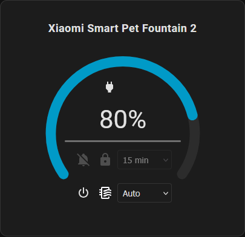

# Xiaomi Smart Pet Fountain 2 Card

<a href="https://github.com/hacs/integration"></a>

A custom Home Assistant card to visualize and control the Xiaomi Smart Pet Fountain 2 (xiaomi.pet_waterer.iv02).



## Installation

### Via HACS (Recommended)

1. Click the button below to add this repository to HACS:

   <a href="https://my.home-assistant.io/redirect/hacs_repository/?owner=Gamso&repository=xiaomi_smart_pet_fountain_2_card&category=plugin"></a>

2. Or manually:
   - Open HACS in Home Assistant
   - Go to "Frontend"
   - Click the three-dot menu in the top right
   - Select "Custom repositories"
   - Add this repository URL: `https://github.com/Gamso/xiaomi_smart_pet_fountain_2_card`
   - Select category "Dashboard" (called "Lovelace" in older HACS versions)
   - Click "Add"
   - Search for "Xiaomi Smart Pet Fountain 2 Card"
   - Click "Install"
   - Restart Home Assistant

### Manual Installation

1. Download `xiaomi-smart-pet-fountain-2-card.js` from the latest release
2. Copy the file to your `config/www/` directory
3. Add the resource in your Lovelace configuration:
   - Go to Configuration -> Lovelace Dashboards -> Resources
   - Click "Add Resource"
   - URL: `/local/xiaomi-smart-pet-fountain-2-card.js`
   - Type: JavaScript Module

## Configuration

### ⚡ Auto-Discovery of Entities

The card now uses an **intelligent auto-discovery system**! You can provide **any entity** from your fountain (switch, sensor, select, etc.), and the card will automatically find all related entities.

**How it works:**

1. You provide an entity (e.g., `switch.xiaomi_iv02_b820_pet_drinking_fountain`)
2. The card extracts the base name (e.g., `xiaomi_iv02_b820`)
3. The card automatically searches for all related entities:
   - `switch.xiaomi_iv02_b820_pet_drinking_fountain` (on/off control)
   - `select.xiaomi_iv02_b820_mode` (modes: auto, interval, constant)
   - `sensor.xiaomi_iv02_b820_filter_life_level` (filter life)
   - `button.xiaomi_iv02_b820_reset_filter_life` (reset filter)
   - And all other entities!

### Minimal Configuration

```yaml
type: custom:xiaomi-smart-pet-fountain-2-card
entity: switch.xiaomi_iv02_b820_pet_drinking_fountain
```

or with any related entity:

```yaml
type: custom:xiaomi-smart-pet-fountain-2-card
entity: select.xiaomi_iv02_b820_mode
```

When Home Assistant knows the device of the configured entity (entity
registry), the card also finds the other entities of that device by their
suffix, even if the device prefix was renamed.

### Options

| Option   | Type   | Default                       | Description                                             |
| -------- | ------ | ----------------------------- | ------------------------------------------------------- |
| `entity` | string | **required**                  | Any entity of the fountain, used for the auto-discovery |
| `name`   | string | `Xiaomi Smart Pet Fountain 2` | Card title                                              |

#### Entity overrides (optional)

Each of these options replaces one auto-discovered entity, for renamed entities
or another integration. They are also available in the visual editor, in the
"Entities" section.

| Option                         | Domain          | Replaces the entity ending with |
| ------------------------------ | --------------- | ------------------------------- |
| `power_entity`                 | `switch`        | `_pet_drinking_fountain`        |
| `mode_entity`                  | `select`        | `_mode`                         |
| `filter_life_entity`           | `sensor`        | `_filter_life_level`            |
| `filter_left_time_entity`      | `sensor`        | `_filter_left_time`             |
| `battery_entity`               | `sensor`        | `_battery_level`                |
| `charging_state_entity`        | `sensor`        | `_charging_state`               |
| `water_shortage_entity`        | `binary_sensor` | `_water_shortage_status`        |
| `physical_control_lock_entity` | `switch`        | `_physical_control_locked`      |
| `no_disturb_entity`            | `switch`        | `_no_disturb`                   |
| `water_interval_entity`        | `number`        | `_out_water_interval`           |
| `reset_filter_entity`          | `button`        | `_reset_filter_life`            |

```yaml
type: custom:xiaomi-smart-pet-fountain-2-card
entity: switch.kitchen_fountain_pet_drinking_fountain
name: Cat water
battery_entity: sensor.kitchen_fountain_battery
```

When an entity the card needs can't be found, a banner lists the matching
override options. Controls whose entity is missing are disabled; a missing or
unavailable sensor is shown as unknown (`--`, battery with a question mark),
never as 0 %.

## Using with Xiaomi Miot Integration

This card is designed to work with the [Xiaomi Miot Auto](https://github.com/al-one/hass-xiaomi-miot) integration for Home Assistant.

### Prerequisites

1. Install the Xiaomi Miot Auto integration via HACS
2. Configure your Xiaomi Smart Pet Fountain 2
3. The entity should appear as `xiaomi.pet_waterer.iv02` (or similar)

### Created Entities

The Xiaomi Miot integration automatically creates the following entities for the Xiaomi Smart Pet Fountain 2:

#### Sensors

- `sensor.xiaomi_iv02_b820_filter_life_level` - Remaining filter life (%)
- `sensor.xiaomi_iv02_b820_filter_left_time` - Remaining filter time (days)
- `sensor.xiaomi_iv02_b820_battery_level` - Battery level (%)
- `sensor.xiaomi_iv02_b820_charging_state` - Battery charging state
- `sensor.xiaomi_iv02_b820_status` - Water pump operating status
- `sensor.xiaomi_iv02_b820_event_mode` - Mode event
- `sensor.xiaomi_iv02_b820_event_water` - Water event

#### Binary Sensors

- `binary_sensor.xiaomi_iv02_b820_water_shortage_status` - Water shortage

#### Switches

- `switch.xiaomi_iv02_b820_pet_drinking_fountain` - Pet drinking fountain
- `switch.xiaomi_iv02_b820_physical_control_locked` - Physical control lock
- `switch.xiaomi_iv02_b820_no_disturb` - Do not disturb

#### Selects

- `select.xiaomi_iv02_b820_mode` - Operating mode (auto, interval, constant)

#### Numbers

- `number.xiaomi_iv02_b820_out_water_interval` - Water dispensing interval
- `number.xiaomi_iv02_b820_out_water_interval_2` - Water dispensing interval (2)

#### Buttons

- `button.xiaomi_iv02_b820_info` - Info
- `button.xiaomi_iv02_b820_reset_filter_life` - Reset filter life

### Supported Attributes

The card displays and controls:

- Power state (on/off) - `switch.xiaomi_iv02_b820_pet_drinking_fountain`
- Water shortage indicator (shown only when water is lacking; the fountain
  reports a shortage, not a water level) - `binary_sensor.xiaomi_iv02_b820_water_shortage_status`
- Filter life gauge, with the days left as tooltip - `sensor.xiaomi_iv02_b820_filter_life_level`, `sensor.xiaomi_iv02_b820_filter_left_time`
- Battery level and charging state - `sensor.xiaomi_iv02_b820_battery_level`, `sensor.xiaomi_iv02_b820_charging_state`
- Operating mode (auto, interval, constant) - `select.xiaomi_iv02_b820_mode`
- Water interval (enabled in interval mode) - `number.xiaomi_iv02_b820_out_water_interval`
- No disturb and physical control lock - `switch.xiaomi_iv02_b820_no_disturb`, `switch.xiaomi_iv02_b820_physical_control_locked`
- Filter life reset, after a confirmation - `button.xiaomi_iv02_b820_reset_filter_life`

### Used Services

The card uses the following services:

- `homeassistant.turn_on` / `homeassistant.turn_off` - To turn the fountain, no disturb and the physical control lock on/off
- `select.select_option` - To change the operating mode
- `number.set_value` - To change water interval
- `button.press` - To reset filter life

A failed call (device offline, invalid value) is reported as a Home Assistant
notification.

## Development

### DevContainer (Recommended)

To test the card in an isolated Home Assistant environment:

1. Open the project in VS Code
2. Install the "Dev Containers" extension
3. Click "Reopen in Container"
4. Home Assistant will be available at `http://localhost:8123`

See [.devcontainer/README.md](.devcontainer/README.md) for more details.

### Prerequisites

- Node.js 18 or higher to build (Rollup 4); Node.js 22.12 or higher (24 in
  CI) to run the tests and the linter
- npm

### Installing Dependencies

```bash
npm ci
```

### Build

```bash
npm run build
```

The compiled file will be generated in `dist/xiaomi-smart-pet-fountain-2-card.js`.
It is committed: HACS installs it straight from the repository, so rebuild and
commit it with any source change (the CI fails when `dist/` doesn't match the
sources). The release build has no source map.

### Checks

```bash
npm run typecheck   # TypeScript, sources and tests
npm run lint        # ESLint
npm test            # Vitest
```

### Watch Mode

For development with automatic reloading (emits a source map, git-ignored):

```bash
npm run watch
```

## License

MIT License

## Credits

Developed for the Home Assistant community.
